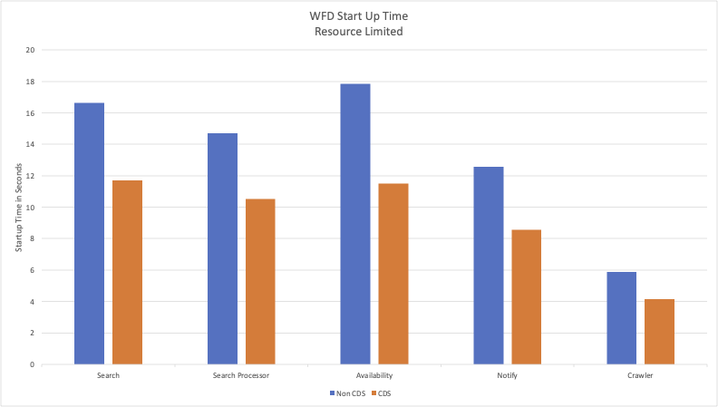
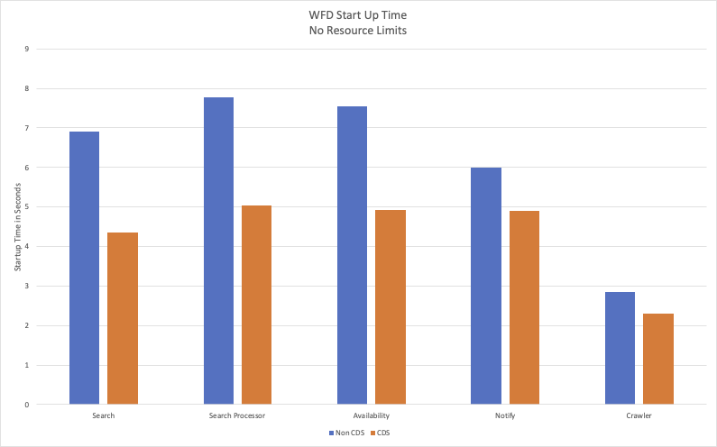

# Where For Dinner CDS + TAP Preview

A preview using Anthony Dahanne's [java buildpack](https://hub.docker.com/r/anthonydahanne/java/tags) and Spring Boot 3.3.0-M3 to build a subset of
Where For Dinner services using [CDS](https://spring.io/blog/2023/12/04/cds-with-spring-framework-6-1) and Supply Chain Choreographer for Tanzu on TAP.
The purpose is to demonstrate the ability to use CDS on TAP and to compare startup times with non CDS enabled workloads.

These instructions assume you are using at least TAP 1.8.x and have installed a cluster supply chain capable of building Java `server` workloads.  It
also assumes that you have cloned this repository to your workstation, have a K8s context targeting your cluster, and have installed the Tanzu CLI with the
`apps` and `services` plugin.

## Installing Cluster Builder

To use the custom buildpack, you need to install it into your cluster and create a `ClusterBuilder` to consume.  To install the buildpack and `ClusterBuilder`,
run the following commands.

```
kubectl apply -f cdsBuildPack.yaml
kubectl apply -f cdsClusterBuilder.yaml
```

Confirm that the buildpack and `ClusterBuilder` are in a ready state.

```
kubectl get clusterbuilder cds 
```

You should see something similar to the following (the image location should be different than below):

```
NAME   LATESTIMAGE                                                                                                           READY   UPTODATE
cds    reg.perfect300rock.com/tapdev/build-service@sha256:e5dde1425b53d37d4de28e5a744b232b91230949138774579c35b7d5ba1a5805   True    True
```

## Deploy RabbitMQ Service

At minimum, Where For Dinner requires a RabbitMQ instance to function.  To deploy the RabbitMQ instance, run the following command:
**NOTE:** Include the namespace if you do not use `default` as your developer namespace.


```
tanzu services class-claim create msgbroker-where-for-dinner --class rabbitmq-unmanaged
```

## Build The Workloads

The services contain configuration for both CDS and non-CDS enabled workloads.  You can deploy the workloads with the following commands and compare the startup times:
**NOTE:** Include the namespace after each command if you do not use `default` as your developer namespace.


**CDS Enabled**

```
kubectl apply -f workloads/where-for-dinner-search/config/workloadCDS.yaml
kubectl apply -f workloads/where-for-dinner-search-proc/config/workloadCDS.yaml
kubectl apply -f workloads/where-for-dinner-notify/config/workloadCDS.yaml
kubectl apply -f workloads/where-for-dinner-availability/config/workloadCDS.yaml
kubectl apply -f workloads/where-for-dinner-crawler/config/workloadCDS.yaml
```

**Non CDS**

```
kubectl apply -f workloads/where-for-dinner-search/config/workload.yaml
kubectl apply -f workloads/where-for-dinner-search-proc/config/workload.yaml
kubectl apply -f workloads/where-for-dinner-notify/config/workload.yaml
kubectl apply -f workloads/where-for-dinner-availability/config/workload.yaml
kubectl apply -f workloads/where-for-dinner-crawler/config/workload.yaml
```

## Startup Time Improvement

The following charts illustrate representitive startup time improvements using resource limits of 1.5 CPUs and as well as comparisons with no resource limits.  The
following charts uses AWS `t3.2xlarge` types for each worker node in the cluster.



